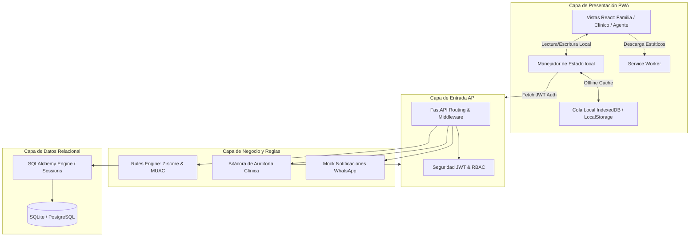

# Arquitectura del Sistema - Yanapiri Wawa

Este documento detalla el diseño arquitectónico y las decisiones de software tomadas para el MVP de **Yanapiri Wawa**.

---

## 1. Patrón General: Monolito Modular Orientado a Servicios

Se ha optado por una arquitectura de **Monolito Modular** desacoplado en el backend y una SPA responsive con capacidades de PWA en el frontend. Esta estructura minimiza la sobreingeniería inicial y permite la portabilidad durante el despliegue local (adecuado para demostraciones o hackathons), pero con separación de capas para facilitar la migración futura a microservicios si fuera necesario.



---

## 2. Descripción de Componentes Clave

### 2.1 PWA (Frontend Offline-First)
- **Service Worker (`pwa-sw.js`):** Registra e intercepta las peticiones `GET` del navegador para servir los recursos estáticos desde la caché del navegador en caso de corte de señal. Excluye deliberadamente los endpoints `/api` para evitar colisiones de datos.
- **Cola de Sincronización Local:** Almacena peticiones pendientes en una cola JSON inmutable en el LocalStorage si el navegador detecta que `navigator.onLine === false` o si las llamadas Fetch fallan por latencia. Al detectar que la conexión ha retornado, la PWA hace un barrido enviando las mediciones al backend respetando la inmutabilidad y orden temporal de inserción.

### 2.2 Rules Engine (Motor de Reglas Clínicas)
- Encapsulado en `backend/app/rules.py` de forma aislada.
- No utiliza IA generativa para la toma de decisiones clínicas para evitar alucinaciones críticas de salud.
- **Peso-para-Edad:** Utiliza tablas de percentiles oficiales de la OMS para niños y niñas (0 a 60 meses), realizando una **interpolación lineal continua** para calcular el Z-score exacto según la edad en meses y sexo del niño.
- **MUAC:** Evalúa el perímetro braquial en base a umbrales UNICEF (Urgente < 11.5 cm, Seguimiento < 12.5 cm, Normal >= 12.5 cm).
- Asocia cada alerta a la versión específica de la regla y la fuente oficial de procedencia (ej. "Norma Técnica de Salud CRED MINSA NTS 137").

### 2.3 Sistema de Notificaciones (WhatsApp)
- Desacoplado mediante el servicio `NotificationService`. El backend cuenta con un mock adapter que simula la conexión con la API de WhatsApp Business.
- Por seguridad de datos personales, el servicio **no envía datos clínicos sensibles** en los mensajes de texto (ej. "Riesgo de desnutrición"). En su lugar, envía un enlace de acceso seguro: *"Hay una actualización importante sobre el seguimiento de Juan. Ingrese a Yanapiri Wawa para revisarla."*

---

## 3. Flujo de Datos para Mediciones Domiciliarias

El ciclo de vida de una medición sigue el siguiente flujo de validación y control:

```text
Cuidador ingresa Peso (Wizard)
       │
       ▼
Validación de Límites en Frontend (Filtra errores de tipeo absurdos)
       │
       ▼
¿Hay Internet?
 ├─► NO: Guardar en cola local (Estado: "Pendiente")
 └─► SÍ: Enviar POST a /children/{id}/measurements
             │
             ├─► API valida JWT y permisos del rol (RBAC)
             ├─► API calcula diferencia con última medición (Validación de cambios bruscos >30%)
             ├─► Motor calcula Z-score y define Alerta (normal/follow-up/urgent)
             ├─► Se registra Log de Auditoría (Trazabilidad clínica inmutable)
             ├─► Se almacena en Base de Datos
             └─► Retorna respuesta a la PWA (Sincroniza UI)
```
