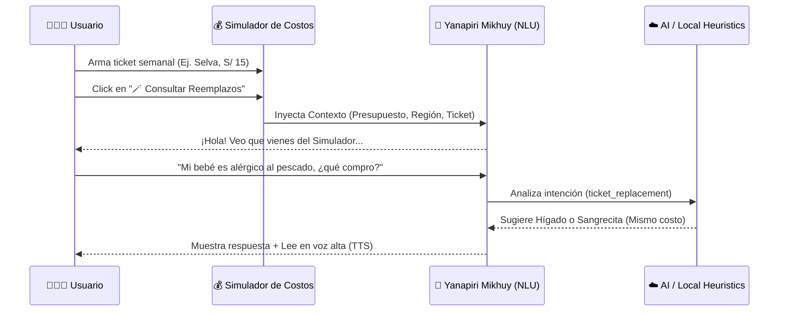

# Arquitectura de Inteligencia Artificial (NLU & Simulador)

Yanapiri Wawa implementa un ecosistema de inteligencia artificial centrado en la accesibilidad y el procesamiento de lenguaje natural (NLU).

## Asistente NLU Multilingüe (Yanapiri Mikhuy)
Es un chatbot inteligente con reconocimiento de intenciones (NLU) integrado y soporte Text-to-Speech (TTS). Entiende consultas en Español, Quechua y Aymara, y está conectado directamente al ecosistema.

### Diagrama de Secuencia

## Integración
- **Simulador de Costo-Efectividad Nutricional:** Herramienta interactiva que diseña canastas básicas ricas en hierro según el presupuesto y la región de la familia (Costa, Sierra, Selva), generando un "Ticket Semanal" optimizado con alternativas súper económicas como la sangrecita o el bazo.
- La IA intercepta intenciones locales usando una heurística rápida antes de consultar al LLM, garantizando un funcionamiento sin conexión o de baja latencia para casos de uso comunes (como reemplazos).
