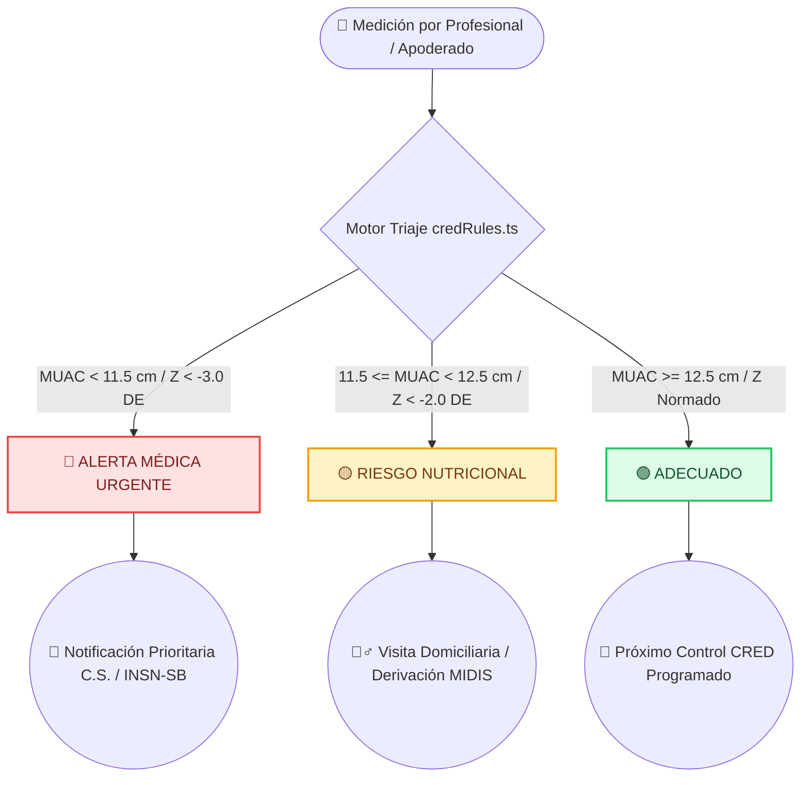

# Reglas de Alerta Clínica y Fuentes Oficiales (CLINICAL_RULES.md)

El motor de reglas antropométricas y triaje clínico de **NutriCRED - Crecer mejor** implementa algoritmos de clasificación de riesgo validados por la **Organización Mundial de la Salud (OMS)**, la Norma Técnica CRED del **Ministerio de Salud del Perú (MINSA)** y los estándares pediátricos del **Instituto Nacional de Salud del Niño San Borja (INSN-SB)** para niñas y niños de **0 a 5 años** (0 a 59 meses).

---

## Flujo de Decisión Clínica Automática

---

## 1. Frecuencia Mínima de Controles CRED (NTS N° 137-MINSA/DGIESP)

El motor `src/app/lib/credRules.ts` evalúa la edad exacta del menor en meses y calcula la fecha del próximo control obligatoria:

| Grupo Etario | Rango de Edad | Frecuencia de Control CRED | Intervalo Máximo Tolerado |
| :--- | :--- | :--- | :--- |
| **Neonato** | 0 a 29 días | Cada 7 días (4 controles al mes) | 10 días |
| **Lactante** | 1 a 11 meses | Cada 30 días (1 control al mes) | 45 días |
| **1 a 2 años** | 12 a 23 meses | Cada 60 días (1 control cada 2 meses) | 75 días |
| **Preescolar** | 2 a 4 años | Cada 90 días (1 control cada 3 meses) | 120 días |
| **Escolar** | 5 a 11 años | Cada 180 días (1 control cada 6 meses) | 210 días |

### Multiplicadores de Riesgo Nutricional OMS:
- 🟢 **Adecuado:** Cumplimiento del calendario estándar CRED MINSA.
- 🟡 **Riesgo Nutricional:** Frecuencia de seguimiento intensificada a 15-30 días (Alerta preventiva activa 7 días antes).
- 🔴 **Alerta Médica:** Citación prioritaria de 24h a 7 días.

---

## 2. Perímetro Braquial / MUAC (Mid-Upper Arm Circumference)

Utilizado para la detección rápida de desnutrición aguda en niñas y niños de 6 a 59 meses de edad:
- **Alerta Médica Urgencia (Semáforo ROJO / `urgent`):** `MUAC < 11.5 cm` (< 115 mm).
  - *Interpretación Clínica:* Indicador de **Desnutrición Aguda Severa (DAS)**. Alto riesgo de mortalidad infantil. Requiere atención médica inmediata en puesto de salud o derivación al INSN San Borja.
- **Riesgo Nutricional (Semáforo AMARILLO / `follow-up`):** `11.5 cm <= MUAC < 12.5 cm` (115 mm - 124 mm).
  - *Interpretación Clínica:* Indicador de **Desnutrición Aguda Moderada (DAM)** o riesgo inminente. Requiere visita domiciliaria de agente comunitario y consejería alimentaria.
- **Adecuado (Semáforo VERDE / `normal`):** `MUAC >= 12.5 cm` (>= 125 mm).
  - *Interpretación Clínica:* Perímetro braquial dentro del rango eustrófico.

---

## 3. Desviaciones Estándar Z-Score (Curvas OMS 2006)

Evaluación del indicador antropométrico Peso/Talla (P/T) y Peso/Edad (P/E) expresado en puntuación Z. El sistema calcula la puntuación Z utilizando la fórmula estandarizada LMS de la OMS:

$$
Z = \frac{\left( \frac{Y}{M} \right)^L - 1}{L \cdot S}
$$

*Donde $Y$ es la medida observada, $M$ es la mediana de referencia, $L$ es la potencia (asimetría) y $S$ es el coeficiente de variación.*

- **Z-Score < -3.0 DE:** Desnutrición Severa / Emaciación Grave. → **Alerta Médica Urgencia (ROJO)**.
- **-3.0 DE <= Z-Score < -2.0 DE:** Desnutrición Moderada. → **Alerta Médica Urgencia (ROJO)**.
- **-2.0 DE <= Z-Score < -1.0 DE:** Riesgo de Desnutrición / Bajo Peso. → **Riesgo Nutricional (AMARILLO)**.
- **-1.0 DE <= Z-Score <= +2.0 DE:** Estado Nutricional Normal / Eutrófico. → **Adecuado (VERDE)**.
- **Z-Score > +2.0 DE:** Sobrepeso / Riesgo de Obesidad. → **Riesgo Nutricional (AMARILLO)**.

---

## 4. Matriz de Fuentes Oficiales y Normas Técnicas

| Dominio Clínico | Norma / Estándar Oficial | Organismo Emisor | Documento de Referencia |
| :--- | :--- | :--- | :--- |
| **Estándares de Crecimiento** | Patrones de Crecimiento Infantil de la OMS (2006) | Organización Mundial de la Salud (OMS) | [WHO Child Growth Standards](https://www.who.int/tools/child-growth-standards) |
| **Evaluación CRED (0-5 años)** | NTS N° 137-MINSA/2017/DGIESP | Ministerio de Salud del Perú (MINSA) | RM N° 229-2017/MINSA - Norma Técnica CRED |
| **Prevalencia de Anemia** | ENDES 2025 (34.9% en niños 6-35m) | Instituto Nacional de Estadística e Informática (INEI) | Informe Principal ENDES 2025 |
| **Atención Pediátrica Especializada** | Guías de Atención del INSN San Borja | Instituto Nacional de Salud del Niño San Borja (INSN-SB) | Protocolos Clínicos INSN-SB |
| **Alimentos & Precios** | Tabla de Alimentos INS/CENAN + Precios MIDAGRI | INS / MIDAGRI | Composición de Alimentos Peruanos |
| **Protección de Datos** | Ley N° 29733 (Protección de Datos Personales) | Ministerio de Justicia (JUS) | Ley 29733 y DS 003-2013-JUS |
