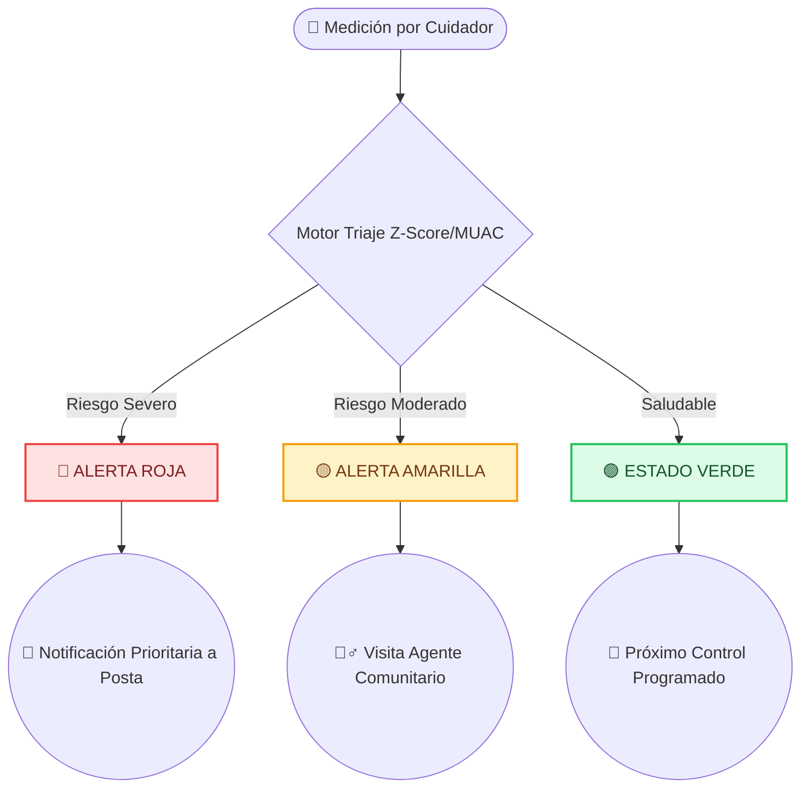

# Reglas de Alerta Clínica Validadas y Fuentes Oficiales

El motor de reglas antropométricas y triaje clínico de Yanapiri Wawa implementa algoritmos de clasificación de riesgo validados por la **Organización Mundial de la Salud (OMS)** y adoptados oficialmente por el **Ministerio de Salud del Perú (MINSA)**.

## Flujo de Decisión Clínica Automática

## 1. Perímetro Braquial / MUAC (Mid-Upper Arm Circumference)
Utilizado para la detección rápida de desnutrición aguda en niñas y niños de 6 a 59 meses de edad:
- **Alerta Crítica (Semáforo ROJO / `urgent`):** `MUAC < 11.5 cm` (< 115 mm).
  - *Interpretación Clínica:* Indicador de **Desnutrición Aguda Severa (DAS)**. Alto riesgo de mortalidad infantil. Requiere atención médica inmediata y derivación prioritaria.
- **Alerta de Seguimiento (Semáforo AMARILLO / `follow-up`):** `11.5 cm <= MUAC < 12.5 cm` (115 mm - 124 mm).
  - *Interpretación Clínica:* Indicador de **Desnutrición Aguda Moderada (DAM)** o riesgo inminente de desnutrición. Requiere visita de campo del agente comunitario y consejería nutricional.
- **Sin Alerta (Semáforo VERDE / `normal`):** `MUAC >= 12.5 cm` (>= 125 mm).
  - *Interpretación Clínica:* Perímetro braquial dentro del rango de normalidad nutricional.

## 2. Desviaciones Estándar Z-Score (Curvas OMS 2006)
Evaluación del indicador antropométrico Peso/Talla (P/T) y Peso/Edad (P/E) expresado en puntuación Z. El sistema calcula la puntuación Z utilizando la fórmula estandarizada LMS de la OMS:

$$
Z = \frac{\left( \frac{Y}{M} \right)^L - 1}{L \cdot S}
$$

*Donde $Y$ es la medida observada, $M$ es la mediana de referencia, $L$ es la potencia (asimetría) y $S$ es el coeficiente de variación.*

- **Z-Score < -3.0 DE:** Desnutrición Severa / Emaciación Grave. → **Alerta Crítica (ROJO)**.
- **-3.0 DE <= Z-Score < -2.0 DE:** Desnutrición Moderada. → **Alerta Crítica (ROJO)**.
- **-2.0 DE <= Z-Score < -1.0 DE:** Riesgo de Desnutrición / Bajo Peso. → **Alerta de Seguimiento (AMARILLO)**.
- **-1.0 DE <= Z-Score <= +2.0 DE:** Estado Nutricional Normal / Eutrófico. → **Seguimiento Normal (VERDE)**.
- **Z-Score > +2.0 DE:** Sobrepeso / Riesgo de Obesidad. → **Alerta de Seguimiento (AMARILLO)**.

## 3. Matriz de Fuentes Oficiales y Normas Técnicas

| Dominio Clínico | Norma / Estándar Oficial | Organismo Emisor | Enlace / Documento de Referencia |
| :--- | :--- | :--- | :--- |
| **Estándares de Crecimiento** | Patrones de Crecimiento Infantil de la OMS (2006) | Organización Mundial de la Salud (OMS) | [WHO Child Growth Standards](https://www.who.int/tools/child-growth-standards) |
| **Evaluación CRED** | NTS N° 137-MINSA/2017/DGIESP | Ministerio de Salud del Perú (MINSA) | RM N° 229-2017/MINSA - Norma Técnica CRED |
| **Diagnóstico de Desnutrición** | Joint Statement on Severe Acute Malnutrition (MUAC Thresholds) | WHO / UNICEF | [WHO/UNICEF SAM Guidelines](https://www.who.int/publications/i/item/9789241548649) |
| **Prevención de Anemia** | NTS N° 134-MINSA/2017/DGIESP | Ministerio de Salud del Perú (MINSA) | RM N° 250-2017/MINSA - Manejo de Anemia |
| **Protección de Datos** | Ley N° 29733 (Ley de Protección de Datos Personales) | Ministerio de Justicia / Congreso del Perú | Ley 29733 y su Reglamento DS 003-2013-JUS |
